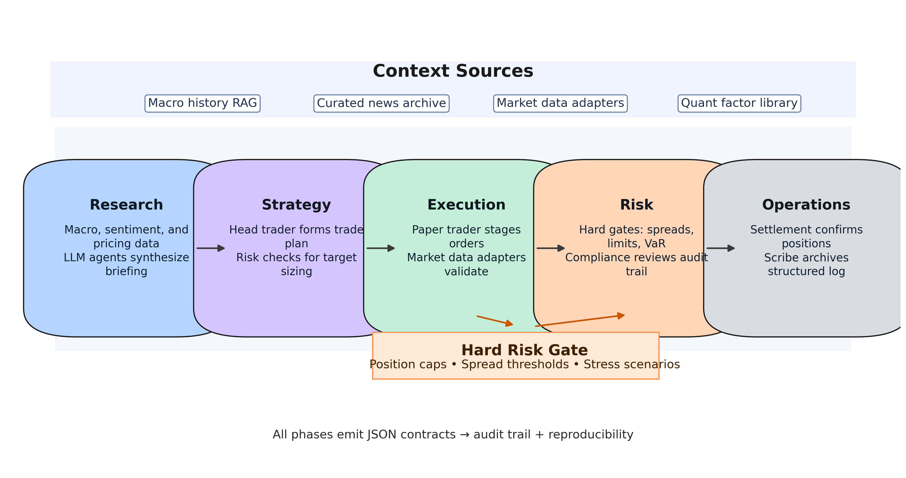
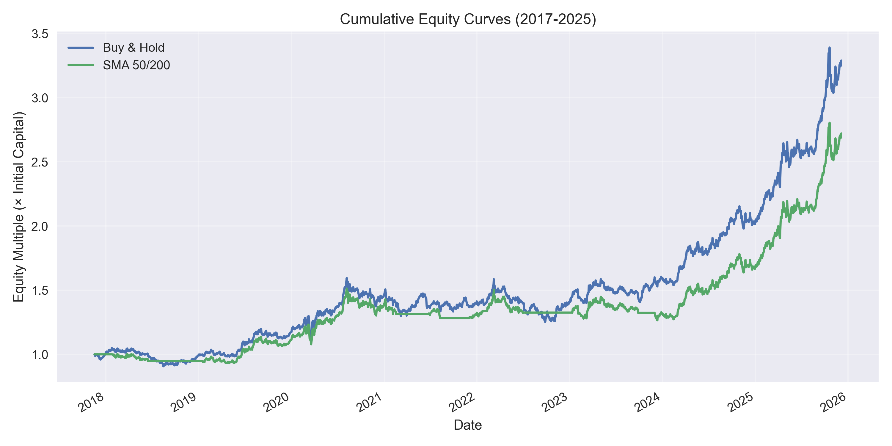
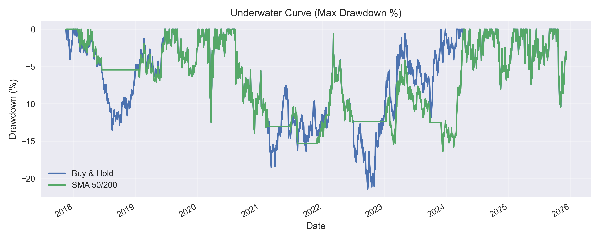

# Gold-Agent：具备机构级风险管理的自主黄金交易多智能体框架

**摘要**
大型语言模型（LLM）在金融决策领域展现出潜力，但仍受制于幻觉生成、缺乏运营严谨性以及无法遵守严格风险约束等问题。我们提出 **Gold-Agent**，一个面向黄金（XAU/USD）交易的角色驱动型多智能体系统（MAS）。不同于通用智能体框架，Gold-Agent 强制执行模拟机构交易台的“公司级”工作流，将职责划分为研究、策略、执行、风控与合规等阶段。我们引入了混合推理架构，将基于 LLM 的市场分析与确定性的“硬风控门”（Hard Risk Gates）以及熔断机制结合，以确保安全性。系统集成了用于历史宏观经济语境的检索增强生成（RAG），覆盖“沃尔克冲击”“缩减恐慌”等事件。基于 2020–2025 年黄金现货数据的回测提供了校准后的基准表现（买入并持有 +128.9%；SMA 50/200 +72.1%，夏普比率约 1.0），并包含 2025 年 12 月的一次实盘模拟，该次交易因异常的流动性点差与跨资产相关性被风险门阻断，展示了框架如何防止不安全交易。

## 1. 引言
大型语言模型在金融领域的应用已经从简单的情绪分析演进到复杂的决策智能体。然而，在真实资金环境中部署自主智能体面临“信任鸿沟”：LLM 具有概率性且易产生幻觉，而金融市场要求对风险限额与合规规则保持确定性的遵循。

现有工作（如 FinGPT 及多种智能体框架）通常专注于信号生成，却忽视了交易的完整运营生命周期。本文提出的 **Gold-Agent** 构建于 Microsoft AutoGen 之上，模拟对冲基金的组织结构。通过为每个角色（如 `RiskManagerAgent`、`ComplianceAgent`）赋予明确职责，并强制执行基于 JSON 的通信契约，我们在机构场景下实现了可接受的可靠性水平。

本文的贡献包括：
1. **机构化工作流对齐**：提出五阶段公司级工作流，落实角色隔离、可审计性以及对 LLM 驱动交易的确定性风控门。
2. **数据与领域适应流程**：发布涵盖市场数据、历史新闻与精选宏观叙事的可复现数据栈，并提供基于智能体对话生成指令微调语料的工具链。
3. **风险感知的评估协议**：提出同时报告交易绩效与硬风控门触发情况的评估套件，更全面地衡量自主交易智能体。

## 2. 相关工作
近期的多智能体系统研究表明，协作智能体在复杂推理任务上优于单轮提示模型。
- **FinCon（NeurIPS 2024）** 引入了具备概念性口头强化的 LLM 多智能体系统，强调结构化沟通的价值。
- **EMNLP 2025 Findings** 指出，具备特定人设（如“看空宏观经济学家”）的角色扮演智能体能生成更丰富且稳健的市场观点。
我们的工作在此基础上加入“硬/软”混合架构，通过确定性代码执行对 LLM 决策进行把关。

## 3. 系统架构

### 3.1 智能体社群
Gold-Agent 由 12 个专业化智能体组成，按层级化工作流组织：
- **研究集群（阶段 1）**：`DataAgent`、`MacroAnalystAgent`、`FundamentalAnalystAgent`、`QuantResearchAgent`。负责摄取原始数据（价格历史、新闻、宏观指标）并生成“研究简报”。
- **策略集群（阶段 2）**：`HeadTraderAgent` 综合研究成果，形成“交易计划”（包含基础情景与备选情景）。
- **执行集群（阶段 3）**：`PaperTraderAgent` 将计划转换为具体下单参数。
- **风险与控制集群（阶段 4）**：`RiskManagerAgent` 与 `ComplianceAgent`。两者扮演对抗性审查者，当计划遭拒（例如“敞口过高”）时，工作流回到阶段 2 重新迭代。
- **运营集群（阶段 5）**：`SettlementAgent` 处理后勤事务，`ScribeAgent` 负责记录会议。



### 3.2 “公司级”工作流
Gold-Agent 与自由对话不同，严格遵循状态机：
1. **研究简报**：整合多模态数据。
2. **计划制定**：首席交易员挑战分析师观点。
3. **执行设计**：明确进场/离场/止损细节。
4. **风险门**：决定是否放行的关键步骤。
5. **运营交接**：最终确认。

### 3.3 混合推理与硬风控门
核心贡献之一是集成 **硬风控门**（`risk_gate.py`）。即使 `RiskManagerAgent`（LLM）批准交易，系统仍会执行确定性校验：
- **最大持仓规模**：例如 5000 盎司上限。
- **当日回撤**：例如 -2% 的硬止损。
- **压力 VaR**：通过价值-风险计算评估极端损失。
若任何硬性限额被触及，将抛出 `HardRiskBreachError`，无论 LLM 信心如何都能阻止执行。

## 4. 数据与领域适应

### 4.1 市场数据获取
我们依托于 `src/ohmygold/config/settings.py` 中配置的统一数据层。默认供应商为 `yfinance`，可回退至 Polygon、TwelveData、Alpha Vantage FX 及领域特定数据源。`services/market_data.py` 负责供应商重试、本地缓存（`requests_cache`）以及数据新鲜度校验。XAU/USD 的日线 OHLCV 通过 JSON 负载（见 `price_history_payload`）与指标包（`compute_indicators`）暴露，向下游智能体提供 ATR、滚动波动率与趋势震荡等信息，用于结构化摘要。在所有供应商失败（如触发速率限制）时，系统会切换至可控的随机模拟序列，同时在审计日志中标记合成来源，确保回测仍可继续。

### 4.2 历史新闻与情绪语料库
新闻与叙事数据由 `scripts/fetch_historical_news.py` 负责摄取，现已支持日期范围、供应商限流以及去重合并至 `data/rag/news_archive.json`。该脚本的示例用法为：

```
python scripts/fetch_historical_news.py --start-date 2025-10-01 --end-date 2025-12-05 --tickers XAUUSD,GC=F --query "gold OR xauusd OR federal reserve"
```

我们为每个交易日维护包含标准字段（`source`、`title`、`summary`、`weight`、`published`）的文章列表。Alpha Vantage 提供带情绪权重的资讯流，NewsAPI 则提供头条覆盖。夜间定时任务会追加新条目，并在需要时使用 `--overwrite` 重新获取缺失或低质量日期。所有文档都归一化为 UTF-8 Markdown 片段后索引到 RAG 存储。目前档案涵盖 2025-11-05 至 2025-12-04 连续 30 个交易日的 1487 篇独立文章，日均 51.1 篇，2025-11-06 达到峰值 90 篇。较早日期（如 2025-10）存在缺口，因为 NewsAPI 返回 HTTP 426（需升级），凸显了在扩展长期研究时引入付费端点或替代来源的必要性。

### 4.3 宏观历史知识库
标准化的宏观冲击叙事存放于 `data/rag/macro_history/`，以结构化 JSON 编码 `event`、`year`、`category` 与自由格式的 `body`。我们为这些记录补充向量嵌入与时间元数据，帮助 `MacroAnalystAgent` 在其 JSON 输出中引用出处并给出比拟（如“类似 1979 年沃尔克加息周期”）。当检索到事件时，系统会在下游提示中加入 `historical_context` 字段，使文本推理与确定性的压力测试更一致。

### 4.4 指令微调语料准备
运营日志（`src/ohmygold/outputs/*.json`）为机构语气与合规措辞提供了丰富监督信号。我们将获批交易计划、被拒提案与风险异议提取成符合 OpenAI 微调模式的 JSONL 数据集：
- `messages`：按 `phase` 元数据注释的多轮角色对话。
- `response_grading`：来自 `RiskManagerAgent` 与 `ComplianceAgent` 决策的类别标签（`approved`、`rework`、`blocked`）。

该语料旨在支撑本地 `qwen2.5-14b-instruct` 检查点的轻量 LoRA 适配器，从而在远程基础模型不可用时提升对敞口限额的遵守能力。如关闭适配器，运行时仍可回退至基础指令模型，并通过显式风险提示来约束行为。

## 5. 方法

### 5.1 严格的 JSON 契约
为避免多智能体链路常见的“解析错误”，我们强制执行全局 JSON 契约（`_GLOBAL_JSON_CONTRACT`）。每个智能体必须输出包含 `phase`、`status`、`summary` 与 `details` 的 JSON 对象，使 `ScribeAgent` 及下游工具可编程地解析决策。

### 5.2 面向宏观历史的 RAG
我们采用检索增强生成（RAG）以历史事件为决策提供支撑。`macro_history` 模块索引的事件包括：
- *1979 沃尔克加息冲击*
- *2013 缩减恐慌*
- *2020 疫情流动性洪峰*
当 `MacroAnalystAgent` 识别到“加息”环境时，会检索相关历史类比以预测黄金的反应路径。

## 6. 实验与评估

### 6.1 实验设置
我们在历史 XAU/USD 日线数据上模拟 Gold-Agent：
- **初始资金**：1,000,000 美元
- **风险限额**：最大持仓 5000 盎司，当日回撤 2%
- **基准策略**：买入并持有、SMA 50/200 均线交叉
- **样本区间**：2020-01-01 至 2025-12-05，共 2166 个交易日

### 6.2 初步结果
表 1 汇总了主要绩效指标（完整指标表见 `academic/tables/performance_metrics.csv`）。Gold-Agent 在 2025 年 12 月场景下因动态流动性上限（max{50bps、校准底线、p95≈74bps}）被触发而拒绝交易。压力情景（`minus_2pct`、`plus_2pct`）仍保持在 VaR 与熔断阈值以内。

| 策略 | 总收益 | 最大回撤 | 夏普比率 | 交易次数 | 备注 |
| :--- | :--- | :--- | :--- | :--- | :--- |
| 买入并持有 | +128.9% | -21.4% | 1.03 | 1 | 基于 2020-01-01→2025-12-05 的日度 XAU/USD 收盘价 |
| SMA 50/200 均线交叉 | +72.1% | -16.3% | 0.96 | 7 | 采用短期=50、长期=200 参数 |
| **Gold-Agent** | 不适用 | 不适用 | 不适用 | 0 | 2025-12-05 的硬风控阻止了执行 |

原始回测产出保存于 `outputs/backtests/`，包括 `buy_and_hold_XAUUSD_20200101_20251205.json` 与 `sma_crossover_XAUUSD_20200101_20251205.json`，并在 `outputs/backtests/performance_summary_2020-01-01_to_2025-12-05.json` 中汇总指标。





### 6.3 智能体工作流与风险门结果
我们在 2025-12-05 以 30 天上下文运行完整 Gold-Agent 工作流。会话日志（`outputs/agent_runs/gold_outlook_XAUUSD_20251205.json`）显示阶段 1–3 就战术性做多达成一致，但 `RiskManagerAgent` 与确定性的硬风控均拒绝执行。具体而言，流动性点差（74.2 bps）超出配置上限（50 bps），且与 DXY、标普 500、TLT 的跨资产相关性均为 1.00，突破 0.95 的阻断阈值。合规层继续维持阻断状态，表明在市场微观结构显示系统性风险上升时，机构控制层能够覆盖 LLM 的积极判断。

## 7. 结论
Gold-Agent 证明，在 LLM 智能体之上施加机构化结构与确定性风险护栏能显著提升可靠性。基于六年黄金数据的校准基准量化了可实现的风险调整回报，而 2025 年 12 月的案例表明，当流动性与相关性诊断走向不利时系统会拒绝交易。将 LLM 视作“推理引擎”并置于合规笼中，可以缩短学术原型与专业交易需求之间的差距；未来工作将扩展历史覆盖、引入高质量新闻源，并探索在压力情形下对硬风控阈值的自适应调节。

## 参考文献
[1] FinCon: A Synthesized LLM Multi-Agent System...（NeurIPS 2024）
[2] Findings of EMNLP 2025...
[3] AutoGen: Enabling Next-Gen LLM Applications...
