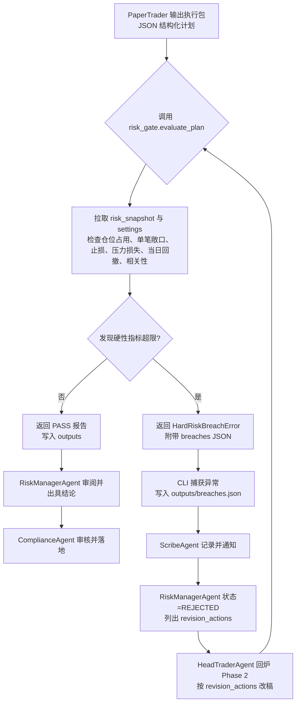

# 风控闸门触发流程

本文档描述 `services.risk_gate.evaluate_plan` 对交易方案执行硬风控校验的关键节点，以及闸门触发后的通知与回路。

## 流程图

## 操作要点

1. **数据输入**：`evaluate_plan` 收到的 plan JSON 来自 PaperTrader 汇总，必须包含仓位、对冲、止损、风险测度。
2. **校验指标**：闸门读取 `config.settings.Settings` 中的 `hard_gate_*` 阈值，并结合最新 `risk_snapshot` 指标进行对比。
3. **触发结果**：
   - **通过**：返回 `RiskGateReport`; 工作流继续由 RiskManager → Compliance → Settlement。
   - **拒绝**：抛出 `HardRiskBreachError`，并在异常内嵌 `breaches` 列表（指标、实测值、上限、处置建议）。
4. **通知链路**：CLI 捕获异常后将 `outputs/risk_gate_breaches.json` 写盘；ScribeAgent 在下一轮广播给 Risk/HeadTrader。
5. **回路闭环**：RiskManagerAgent 根据异常将状态置为 `REJECTED/BLOCKED`，明确 `revision_actions`；HeadTrader 需据此修订方案并重新发起。

> 若需扩展新指标，请在 `services/risk_gate.py` 新增校验函数，并在 `tests/test_risk_gate.py` 添加覆盖。
