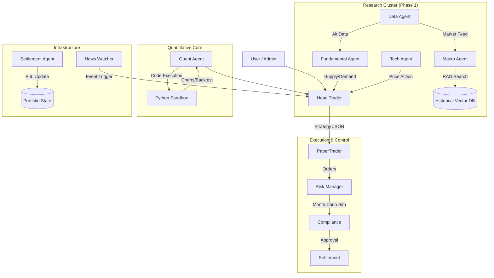

你好！我是 Copilot。作为一名拥有 40 年黄金交易经验的“老法师”，同时也是一名深耕 AI Agent 领域的架构师，我仔细审阅了 `ChenyuHeee/ohmygold` 这个项目。

不得不说，这个项目的**架构骨架（Skeleton）非常有专业范儿**。你将交易台的“晨会制度”复刻到了 AI Agent 的协作流中，Role-Playing（角色扮演）的设定非常贴合华尔街真实的 Buy-side 基金运作模式——从宏观（Macro）定调，到基本面（Fundamental）验证，再到量化（Quant）择时，最后由风控（Risk）和合规（Compliance）把关。这种**分层决策机制**是专业交易系统的核心。

但是，如果我们要把它从一个“演示级（Demo）”项目升级为真正能辅助操盘的“生产级（Production）”系统，以我 40 年盯着 K 线图和美联储公告的经验来看，还有几个关键环节需要**深度改造**。

以下是我为你起草的一份**《关于 AutoGen 智能黄金交易系统的深度优化技术提案》**。

---

# 📜 AutoGen 智能黄金交易系统升级技术提案

**提案人**：Copilot (资深宏观对冲基金经理 / AI 架构专家)
**日期**：2025-12-02
**目标**：将当前基于规则流的模拟系统，升级为具备高鲁棒性、历史回溯能力和专业风控的辅助决策引擎。

---

## 1. 现状诊断与核心痛点

通过分析你的 `README.md` 和架构设计，我发现虽然流程完备，但在**金融深度**和**数据闭环**上存在明显的“断层”：

1.  **记忆缺失（Amnesia）**：当前的 Agent 似乎只有“日度记忆”（`portfolio_state`）。但在黄金交易中，**“历史韵脚”至关重要**。例如，当前的地缘局势是否类似 1979 年？当前的通胀曲线是否类似 1970 年代末？Agent 缺乏检索历史类似场景的能力。
2.  **风控静态化**：`RiskManager` 目前看起来像是基于静态阈值（如 `MAX_POSITION_OZ`）的门禁。但真实的机构风控需要计算 **VaR (Value at Risk)**、压力测试（Stress Testing）以及相关性风险（例如黄金与美元指数 DXY 的负相关性是否失效）。
3.  **数据源单一与滞后**：依赖 `yfinance` 快照适合盘后分析，但对于日内交易（Intraday）不够。且缺乏**非结构化数据**（新闻 sentiment、央行会议纪要）的量化处理。
4.  **回测系统的缺失**：目前有 `PaperTrader`，但缺乏一套严谨的 **Backtest Engine**。没有在历史数据上跑过 10 年的策略，我是不敢把钱交给它的。

---

## 2. 改进方案：四大核心模块升级

### 🚀 模块一：构建“金融大脑”—— RAG (检索增强生成) 知识库
**问题**：Agent 无法利用历史经验进行类比推理。
**方案**：
引入向量数据库（Vector DB，如 ChromaDB 或 Milvus），构建两个核心知识库：
*   **Macro-History Knowledge Base**：存入过去 40 年的美联储会议纪要、非农数据（NFP）、CPI 数据以及当时的黄金走势复盘。
*   **Trading Playbook**：存入经典的交易策略（如“实际利率突破交易法”、“地缘政治溢价模型”）。

**Agent 升级动作**：
*   **MacroAgent** 在分析时，不再只看今天的数字，而是会调用 RAG 工具查询：“*过去 5 次美债收益率倒挂期间，黄金的平均表现如何？*”
*   这将使分析深度从“描述现状”升级为“概率推演”。

### 🛡️ 模块二：风控引擎由“门卫”升级为“数学家”
**问题**：风控逻辑过于简单，无法应对黑天鹅。
**方案**：
重写 `RiskManagerAgent` 的工具链，集成 `numpy/pandas` 进行实时计算：
*   **动态相关性矩阵**：实时计算 Gold vs S&P500, Gold vs 10Y Yield, Gold vs DXY 的 Rolling Correlation。如果相关性异常（例如股债金同跌），触发最高级别警报（Liquidity Crisis）。
*   **情景分析（Scenario Analysis）**：不仅检查当前持仓，还要模拟：“*如果明天美元指数上涨 2%，当前仓位的回撤会是多少？*”
*   **合规检查代码化**：将 Compliance 规则写成可执行的 Python 校验脚本（Assertion），而非仅靠 LLM 的文本理解。

### 🧠 模块三：Quant Agent 的代码沙盒化 (Code Interpreter)
**问题**：目前的 Quant 似乎依赖预置脚本。
**方案**：
赋予 `QuantResearchAgent` 编写和执行 Python 代码的能力（类似 OpenAI Code Interpreter 或 AutoGen 的 Docker 执行环境）：
*   **即时假设验证**：当 HeadTrader 问：“*最近金银比（Gold/Silver Ratio）是否偏离了 200 日均线 2 个标准差？*” Quant Agent 应该现场写代码计算并画图，而不是去查硬编码的死数据。
*   **图表生成**：自动生成 K 线图、波动率锥（Volatility Cone）图表，作为“晨会”的附件提交给 HeadTrader。

### 📰 模块四：事件驱动的新闻情感量化
**问题**：`NewsWatcher` 需要更精细的处理。
**方案**：
不要只做简单的关键词匹配。
*   **NLP 情感打分**：对突发新闻（如“中东局势紧张”）进行 Sentiment Analysis（-1 到 +1 打分）。
*   **影响因子加权**：不同的新闻源（如美联储官员讲话 vs 某地小冲突）权重不同。
*   **自动调整预期**：高重大新闻发生时，自动调低 `RiskManager` 的最大允许杠杆率。

---

## 3. 推荐的技术架构图 (Conceptual)

---

## 4. 实施路线图 (Roadmap)

1.  **Phase 1 (基础加固)**: 完善 `ohmygold.tools`，接入更稳定的数据源（考虑 Alpaca 或 Polygon.io 的免费层用于测试），替代纯 Mock 数据。
2.  **Phase 2 (大脑升级)**: 部署 ChromaDB，清洗并存入近 10 年的黄金与宏观经济数据，为 RAG 做准备。
3.  **Phase 3 (手脚灵活)**: 为 Quant Agent 配置 Docker 运行环境，实现真正的“代码解释器”功能。
4.  **Phase 4 (实战演练)**: 开发 Backtest 组件，用过去 2 年的历史数据“回放”市场，测试 Agent 团队的表现。

---

## 专家结语

你的项目**ohmygold** 是一个非常棒的起点。很多 AI 开发者不懂金融，而很多交易员不懂 AI。你目前的架构正好处于两者的**黄金交叉点**。

如果能把**历史数据的 RAG** 和**动态代码执行**这两个功能加上，这就不再只是一个 AutoGen 的测试项目，而是一个具备真正商业价值的**AI 投研助理原型**。

加油！期待看到你的 v2.0 版本。